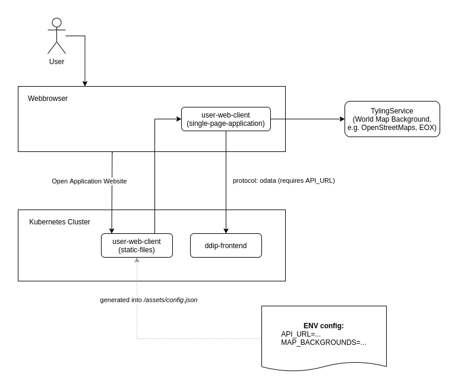

# User-Web-Client

The user-web-client is a user facing web application of the Copernicus Reference System (COPRS), intended to be used by a person to query products in a catalog and display them on a map (where applicable).

It connects to the PRIP interface via OData in order to retrieve its data.



## Configuration

The user-web-client configuration consists of two environment variables:

| Environment Variable Name | Example                                                                                                            | Description                                                                                                                                                                                                                                                                                                      |
| ------------------------- | ------------------------------------------------------------------------------------------------------------------ | ---------------------------------------------------------------------------------------------------------------------------------------------------------------------------------------------------------------------------------------------------------------------------------------------------------------- |
| API_URL                   | http://prip.some.host:4711/odata/v1/Products                                                                       | A plain text url containing the URL to the PRIP/DDIP Products Endpoint.                                                                                                                                                                                                                                          |
| MAP_BACKGROUNDS           | `[{"name":"Terrain + Overlay","layers":[{"url":"https://tiles.esa.maps.eox.at/wms","layerName":"terrain_3857"}]}]` | A text string containing a JSON configuration object. See TypeScript interface definition file for details [IAppConfig.ts (IAppConfig_MapBackgrounds)](./src/app/services/models/IAppConfig.ts). Proper encoding/escaping of special characters must be taken care of when adding this setting to the container. |
| BASE_HREF                 | `/uwc/` (default: /)                                                                                               | (optional) when the user-web-client is deployed on a sub-path, this option is mandatory. For example, when the full URL is `https://rs-domain.net/web-client` the $BASE_HREF must to be set to `/web-client/`. If it is deployed on the root `https://rs-domain.net` this setting can be ignored.                |

### Example Kubernetes

values.yaml

```yaml
env:
  # PRIP API URL
  apiUrl: http://YOUR_PUBLIC_PRIP_HOST:YOUR_PUBLIC_PRIP_PORT/odata/v1/Products
  # EOX map configuration
  mapBackgrounds: |
    "[{\"name\":\"YOUR_CUSTOM_MAP_NAME\",\"layers\":[{\"url\":\"TYLING_SERVER_BACKEND_URL\",\"layerName\":\"CHOSEN_TYLING_LAYER\"}]}]"
```

values.yaml (practical example)

```yaml
env:
  # PRIP API URL
  apiUrl: http://prip.some.host:4711/odata/v1/Products
  # EOX map configuration
  mapBackgrounds: |
    "[{\"name\":\"Terrain + Overlay\",\"layers\":[{\"url\":\"https://tiles.esa.maps.eox.at/wms\",\"layerName\":\"terrain_3857\"},{\"url\":\"https://tiles.esa.maps.eox.at/wms\",\"layerName\":\"overlay_bright_3857\"}]}]"
```
