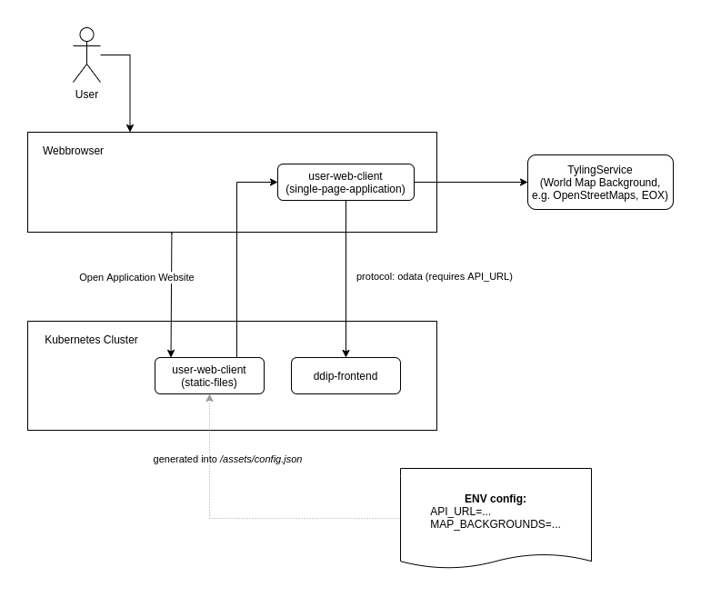

# COPRS-UWC-ADD RS UWC Architecture Document

# Summary
This document is giving an overview about the architecture of the User Web Client of the Copernicus Reference System and showing the most important elements and how they interfacing with each other.

# User Web Client

The user-web-client is a user facing web application of the Copernicus Reference System (COPRS), intended to be used by a person to query products in a catalog and display them on a map (where applicable).

It connects to the PRIP interface via OData in order to retrieve its data.

