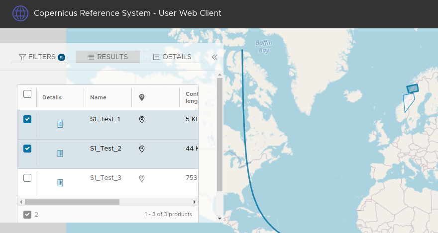

:arrow_heading_up: Go back to the [User Web Client Documentation](../README.md) :arrow_heading_up:

# COPRS-UWC-ICD RS UWC User Manual

# SUMMARY
This document is giving an overview on how to use the User Web Client of the Copernicus Reference System.

# User Web Client
The user-web-client is a user facing web application of the Copernicus Reference System (COPRS), intended to be used by a person to query products in a catalog and display them on a map (where applicable).

## Overview of the user interface

### Sidebar
The sidebar on the left has three tabs containing the FILTERS, RESULT and the DETAILS page. It is maximized by default when starting the UWC.

#### Filters

The FILTERS page offers three ways to add search criteria for products, which are then used to show the filtered products on the RESULT page.
The available filter options are attribute, region or a manual query filter.
#### Attribute Filters

Multiple attribute filters can be provides via text boxes, the most common available options are offered when clicking the boxes or starting to type.

__NOTE:__
When the UWC has been configured by an administrator, certain attribute name filter values can be restricted to date, number or boolean input.

#### Region Filter

To only search in a specified region on the map. When being selected, the sidebar minimizes and allows to select a region as follows:
- Point (one click to select point)
- Line (select two points for a line)
- Polygon (select multiple points, needs to be closed with a click on the first point)

During a selection the process can be cancelled by opening the sidebar and clicking  "cancel selection".

The chosen selection then stays visible on the map.

#### Result Query / Manual Query
The resulting query is displayed at the bottom of the FILTERS tab. As Odata is used for data retrieval an _OData Query_ is used to request the products from the server.

This resulting query can be edited manually if desired, keep in mind that manual changes are overwritten when the forms above are being used again.

For more information on Odata Queries, take a look at the
[Odata Filter Documentation](http://docs.oasis-open.org/odata/odata/v4.0/errata03/os/complete/part1-protocol/odata-v4.0-errata03-os-part1-protocol-complete.html#_Toc453752288)

#### Results Table

The resulting products are shown in the table on the RESULTS page, if products in the list have a footprint, the footprints are shown on map. If the resulting amount of products is exceeding the page size in the table, one can select to change the pages. Only product footprints on the currently active page are shown on the map. When selecting product rows, the associated footprints will be hightlighted on the map, if present.

#### Product Details

When clicking the details button of a product in the RESULTS table or double-clicking a footprint on the map, the details tab on the sidebar is being opened to reveal detailed metadata about the selected product.

### Map Background Switcher

On the button on the top right, the current background layer of the map can be selected.
